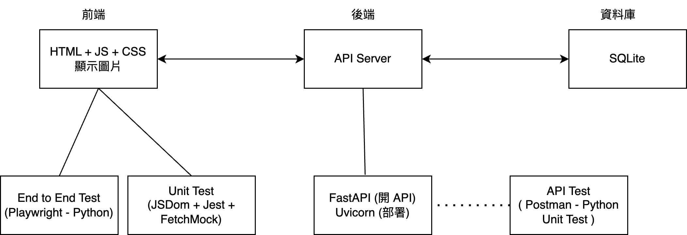
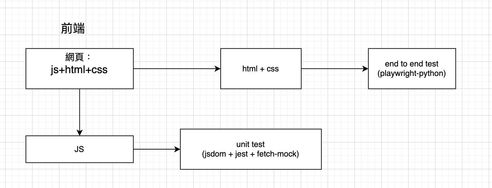
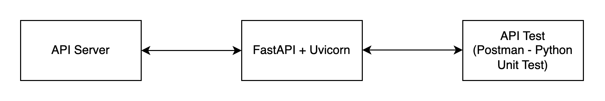

# API Integration and Simple FastAPI Server (Frontend + API + Unit Test)

## Table of Contents

- <a href="#tech-stack">使用的套件列表</a>
- <a href="#getting-started">如何開始</a>
- <a href="#system-architecture">架構圖</a>
- <a href="#prerequisite">背景知識</a>

<h2 id="tech-stack">使用的套件列表</h2>


- [Postman](https://github.com/postmanlabs/postman-app-support): 測 API 的工具
- [FastApi](https://github.com/tiangolo/fastapi/blob/master/README.md): 建立 API
- [FetchMock](https://github.com/wheresrhys/fetch-mock): Mock 打 HTTP 的 Request
- [JsDom](https://github.com/jsdom/jsdom): 建立虛擬的 DOM 環境
- [Jest](https://trpc.io): JS UnitTest 的框架
- [Node.js](https://github.com/nodejs): 在瀏覽器之外執行 JS 程式的工具
- [Playwright](https://github.com/nodejs): Web 自動化測試框架

<h2 id="getting-started">Getting Started</h2>


#### 啟動虛擬環境

前端
```bash
npm install -g serve
cd Desktop/jupyter
cd dog-api-integration/client
serve
```

後端
```bash
pip3 install fastapi uvicorn
cd dog-api-integration/server
sh ./run_api_server.sh
```

<h2 id="system-architecture">System Architecture</h2>

前後端的溝通、資料流向，開 API



前端做了哪些測試以及使用哪些工具



後端 API Server 做了哪些測試以及使用哪些工具





<h2 id="prerequisite">Prerequisite Knowledge</h2>

- [網路運作原理](https://developer.mozilla.org/zh-TW/docs/Learn/Getting_started_with_the_web/How_the_Web_works)：網路如何運作
- [介紹 HTML](https://developer.mozilla.org/zh-TW/docs/Learn/HTML/Introduction_to_HTML)：什麼是HTML
- [測試金字塔](https://medium.com/@nathankpeck/microservice-testing-unit-tests-d795194fe14e):

  Unit Test 測試函數是否按照預期運作


- [FastApi](https://github.com/tiangolo/fastapi/blob/master/README.md) :開 API
- [Uvicorn](https://stackoverflow.com/questions/71435960/what-is-the-purpose-of-uvicorn):部署 API
- [Mock API](https://ithelp.ithome.com.tw/m/articles/10270202):模擬 API Request 和 Response
- [Mock DOM](https://ithelp.ithome.com.tw/m/articles/10270202):模擬瀏覽器產生的 DOM，通常用來測試 JS 操作的流程是否正確


