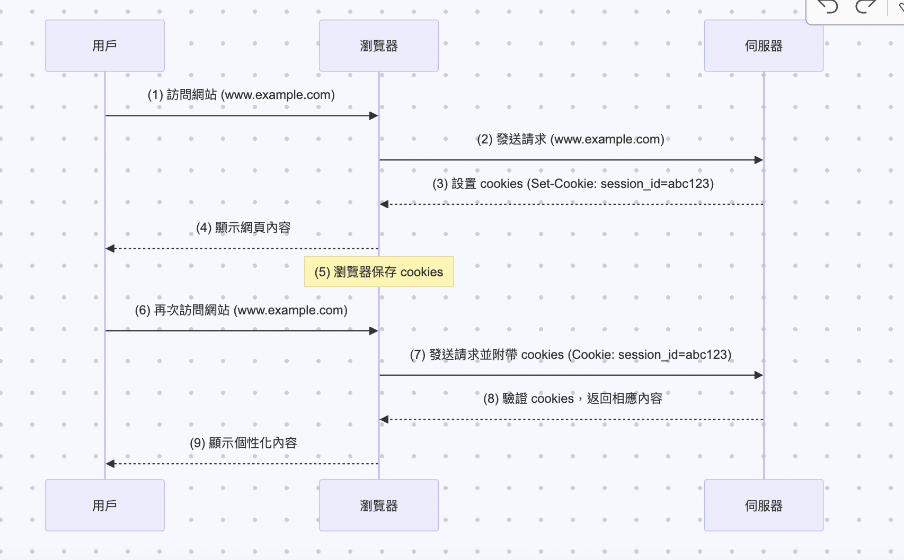

# API Integration and Simple FastAPI Server (Frontend + API + Unit Test)

## Table of contents

- <a href="#tech-stack">使用的套件列表</a>
- <a href="#getting-started">如何開始</a>
- <a href="#system-architecture">架構圖</a>
- <a href="#prerequisite">背景知識</a>

<h2 id="tech-stack">使用的套件列表</h2>

- [Playwright](https://github.com/nodejs): Web 自動化測試框架
- [Python Dotenv](https://hackmd.io/@ME1splK_SaS67P2I6U7h_w/HyScsMQ6h):設置環境變量，存放一些比較敏感的資訊 (如 API access token)
- [Pytest](https://docs.pytest.org/en/stable/): Python 測試框架


<h2 id="getting-started">Getting Started</h2>

#### 啟動虛擬環境
```bash
source ~/.bash_profile
pyenv activate myenv
```

```bash
cd jupyter/sport-center
pytest test_cookies.py
```

<h2 id="system-architecture">System Architecture</h2>


使用者訪問網站時的 Cookies 工作流程圖




<h2 id="prerequisite">Prerequisite Knowledge</h2>

- [什麼是 Cookies](https://blog.csdn.net/m0_62695120/article/details/124009940)：
了解 Cookies 基本原理

- [ 認識 HTTP Cookies](https://developer.mozilla.org/zh-TW/docs/Web/HTTP/Cookies)：
了解 Cookies 基本原理

- [Cookies 運作流程](https://blog.csdn.net/m0_71690645/article/details/131036860)：
使用者訪問網站時的 Cookies 工作流程

- [Cookies 的操作](https://playwright.dev/python/docs/api/class-browsercontext)：
如何使用 Playwright 加載 Cookies 登入網站


